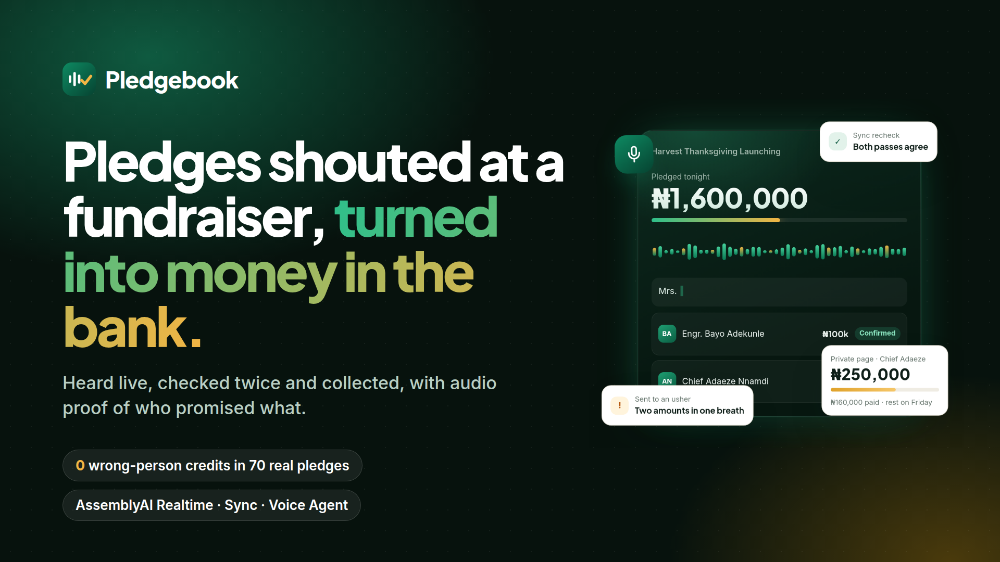

# Pledgebook



**Pledgebook turns the pledges shouted at a fundraiser into money in the bank, with audio proof of who promised what.**

**Live:** [pledgebook.isobars.xyz](https://pledgebook.isobars.xyz/) · **Pitch deck:** [pledgebook-deck.pdf](docs/media/pledgebook-deck.pdf) · Built on AssemblyAI Realtime, Sync and Voice Agent, with Paystack payments.

## The problem

At a Nigerian church launching or school fundraiser, millions of naira are
promised out loud in one evening. The MC calls out *"Chief Emeka Okonkwo,
two hundred and fifty thousand naira!"* over music and applause. Someone
writes it on paper, names get misspelled, amounts get misheard, and months
later nobody can prove who promised what, so the money is never collected.

## What Pledgebook does

1. **Hears every pledge live.** The MC's microphone streams to AssemblyAI
   Realtime. Each pledge appears on screen within seconds, with the audio clip
   it came from kept as evidence.
2. **Checks it twice.** AssemblyAI Sync re-transcribes every clip
   independently. If both passes agree, the pledge is confirmed.
3. **Asks a person when unsure.** An unknown name, two amounts in one breath or
   a number without "thousand" goes to an usher's phone. Nothing is guessed.
4. **Collects it.** Every guest gets a private pledge page. They can hear the
   moment they pledged, pay all or part through Paystack, pick a date, report
   a mistake, or just talk to an AssemblyAI voice agent that confirms who they
   are and takes them to payment.

The rule behind every design choice: **a pledge heard once is not yet a fact.**
It enters the ledger only after two independent passes agree, or a person
decides.

Try it: create an account for your organisation, or follow the
[`operator walkthrough`](docs/judge-guide.md).

## Proven end to end, on real voices

Nothing below is mocked. Every result is from the public deployment.

- **Real-voice benchmark: 70 spoken pledges, zero wrong-person credits, zero
  accepted wrong amounts, zero missed pledges.** 48 of 60 clear lines reached
  the ledger with no human touch; the other 12 were sent to an usher rather
  than guessed. ([`docs/evaluation.md`](docs/evaluation.md))
- **A voice assistant that talks back.** On a guest's private pledge page, the
  AssemblyAI Voice Agent listens to the guest and replies aloud in its
  own voice. It calls real server tools. On 30 September 2026 it
  refused a caller who said she was someone else, then, in a second session,
  confirmed the real guest and opened checkout.
- **Speech to money.** That guest paid ₦100,000 through Paystack; the signed
  webhook credited it and the pledge moved to *Paid in full*, all logged with
  timestamps. ([`docs/verification.md`](docs/verification.md))
- **A working product, not a demo.** It has organisations with owner, admin and
  usher roles, an event lifecycle, usher review on their own phones, partial
  payments, disputes, settlement reports and an activity log. 112 automated
  tests.

## How it works

1. **Set up.** An owner creates the organisation, invites admins and ushers, and
   adds or imports the guest list. The import shows every row before anything
   is added and catches duplicates by name, phone or email.
2. **Listen.** When the event goes live, the MC's microphone streams to
   AssemblyAI Realtime. Guest names are sent as key terms. Each pledge appears on
   the live screen as *Provisional* within seconds, with a short clip of the
   exact words.
3. **Recheck.** That clip goes to AssemblyAI Sync with the guest list and word
   timings. Agreement becomes *Confirmed*. Anything unclear — an unknown name,
   two amounts in one breath, a currency mismatch, the same guest pledging again
   moments later — becomes *Needs checking*. Nothing is guessed.
4. **Review.** Ushers work the review queue on their own phones: play the clip,
   choose the guest, add a walk-in, enter the amount, or reject the line. A name
   an usher resolves is pushed straight into the live listening session, so the
   next mention is recognised.
5. **Follow up.** Staff send each guest a private pledge page by WhatsApp, SMS or
   email. The guest hears the moment they pledged (only when the clip contains
   nobody else's name), pays all or part through Paystack, chooses a date, or
   reports a problem. They can also talk it through with a clearly disclosed
   AssemblyAI voice assistant on their own phone. Staff log calls they make from
   their own phones and record cash or bank-transfer payments.
6. **Settle.** Ending the event produces a settlement report: pledged, received,
   outstanding, promised dates and last contact per guest, exportable as CSV.
   Every change, and who made it, is in the activity log.

## How AssemblyAI is used

- **Realtime Speech-to-Text** hears the room and receives mid-session
  `UpdateConfiguration` messages when an usher adds or resolves a name.
- **Sync** rechecks each short pledge clip with the event description, guest
  names and word timings. We chose Sync over Dictation because the product needs
  the verbatim transcript and timings, not a rewritten one.
- **Voice Agent** runs the guest-side assistant with a generated voice that
  always introduces itself as automated. It confirms who is speaking before
  recording anything and calls server tools to open checkout, record a promised
  date, record a dispute or stop reminders. It never changes the amount.

## Product safeguards

- Accounts, organisations and **owner / admin / usher roles**. Ushers never see
  guest phone numbers or emails. Every event API, export, audio clip and live
  connection checks membership. Writes need a same-origin header; sign-in and
  guest pages are rate limited.
- A full **event lifecycle**: set up, live, paused, ended, reopened, archived,
  deleted. Pausing or ending closes open microphones.
- **Guest administration**: edit, remove, consent changes, search, duplicate
  detection, import preview, per-guest history.
- **Payments are credited exactly once**, may be partial, and are verified with
  Paystack by reference, amount and currency, from the signed webhook or when the
  guest returns from checkout. Offline payments are recorded by staff.
- **Retention**: audio is deleted a set number of days after an event ends;
  sample events are deleted after 24 hours. Daily usage limits per organisation
  protect the service allowance.

## Honest limits

- Paystack is running in **test mode** on the public deployment. The code
  switches to real payments when a live key is configured; see
  [`docs/operations.md`](docs/operations.md).
- Email delivery works on the public deployment through SMTP. A self-hosted
  copy without SMTP settings sends pages by WhatsApp, SMS or a copied link
  from staff phones. There is no automated outbound phone calling.
- The real-voice benchmark recorded **zero wrong-person credits, zero accepted
  wrong amounts and zero missed pledges** across 70 spoken pledges. Of 60 clear
  lines, 48 reached the ledger without a person and 12 required an usher. See
  [`docs/evaluation.md`](docs/evaluation.md) for the complete result and its
  limitations.
- Pledgebook does not claim to understand Nigerian Pidgin, Igbo or Yoruba. It
  finds names and amounts in mixed English speech and asks a person otherwise.

More in [`LIMITATIONS.md`](LIMITATIONS.md). Architecture:
[`docs/architecture.md`](docs/architecture.md). Privacy:
[`docs/privacy.md`](docs/privacy.md). Measured service behaviour:
[`docs/verification.md`](docs/verification.md). Product decisions:
[`docs/decisions.md`](docs/decisions.md).

## Run it locally

```sh
cd pledgebook
python3 -m venv .venv
. .venv/bin/activate
python3 -m pip install -r requirements.txt
cp .env.example .env        # add your AssemblyAI key; Paystack and SMTP are optional
python3 -m uvicorn app.main:app --host 127.0.0.1 --port 8000
```

Open `http://127.0.0.1:8000`, create an account, and create an event or a
sample event. The microphone needs HTTPS when deployed; localhost is allowed.

Tests run without any service keys:

```sh
python3 -m pip install -r requirements-dev.txt
python3 -m pytest -q
```

CircleCI runs the tests, a compile check and a JavaScript syntax check.
Repository: [github.com/Jennycruzy/pledgebook](https://github.com/Jennycruzy/pledgebook).
